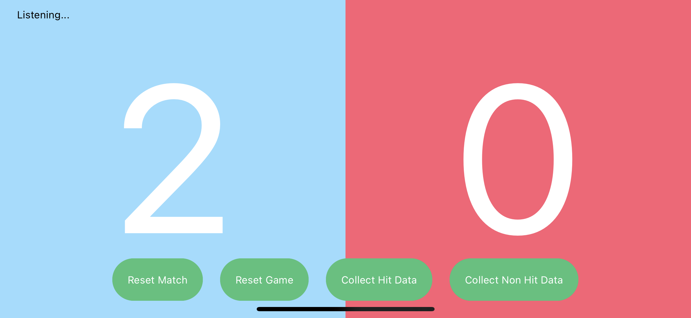

# umpire-ai-ios

:white_check_mark: Completed  
:white_circle: Partially Completed  
:large_blue_circle: In progress  
:red_circle: Todo  

### Tasks
* Bluetooth Low Energy  
  :white_check_mark: Successfully connect to the UmpireAI device  
  :white_check_mark: Send reset game command to the UmpireAI device  
  :large_blue_circle: Send command to reset the match, which means to reset the current game  
  :large_blue_circle: Send command to start collecting "hit" data, which means collect sensor data for ball hits  
  :large_blue_circle: Send command to start collecting "non hit" data, which means collect sensor data for anything other than the ball hits  
  :red_circle: Binary data file download from the UmpireAI device into the iPad  
  :red_circle: Google Cloud connection to storage, save data files there  
* User Interface / User Experience  
  :white_check_mark: Display scores in real time  
  :white_check_mark: Indicate who is currently serving  
  :red_circle: Add UI to show the match winnings over total games played  
  :red_circle: Add UI button to start binary data file download  

### Screenshots
1. UmpireAI iOS Screenshot
