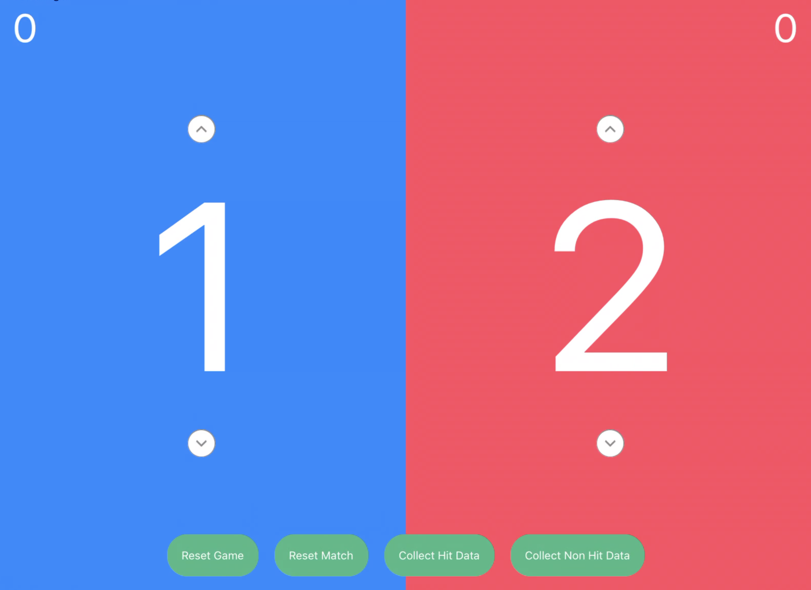
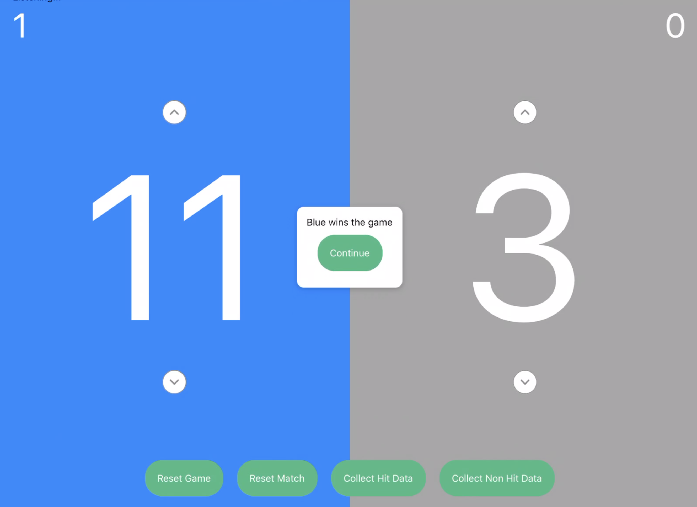

# umpire-ai-ios

:white_check_mark: Completed  
:white_circle: Partially Completed  
:large_blue_circle: In progress  
:red_circle: Todo  

### Tasks
* Bluetooth Low Energy  
  :white_check_mark: Successfully connect to the UmpireAI device  
  :white_check_mark: Send reset game command to the UmpireAI device  
  :white_check_mark: Send reset match command to the UmpireAI device  
  :red_circle: Binary data file download from the UmpireAI device into the iPad  
  :red_circle: Google Cloud connection to storage, save data files there  
* User Interface / User Experience  
  :white_check_mark: Display scores in real time  
  :white_check_mark: Indicate who is currently serving  
  :white_check_mark: Add UI to show the match winnings over total games played  
  :white_check_mark: Add UI to change the scores manually  
  :red_circle: Add UI button to start binary data file download  

### Installation on iPad (Requires a Mac)
1. Make sure you have Xcode on Mac
2. Clone the Github repository: https://github.com/gggonzalez03/umpire-ai-ios
3. Under the “ios” folder, open “UmpireAIiOS_v2.xcodeproj”
4. Connect an iPad with a usb cable
5. Build and run it (use the play button on the top left)
6. Now open the app while the ESP32 is on. This will automatically connect them via BLE.

### Screenshots
1. UmpireAI iOS Screenshot (in-game)

2. UmpireAI iOS Screenshot (game finished)
